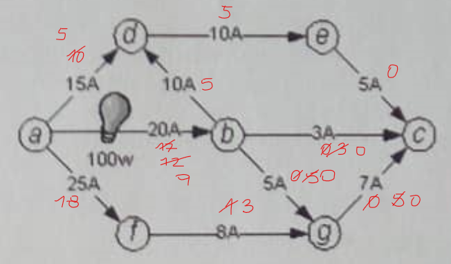

# Exame 2017/2018 - Recurso

1\. a) A estratégia geral consistiria em abastecer o carro, na estação de carregamento mais próxima, sempre que a sua autonomia não permitisse chegar à próxima estação.  

```cpp
int n, m;
int D; // Distância total a percorrer
int d[n]; // Distâncias das estações de carregamento ao ponto de partida (d0, d1, d2, d3..)
int lastCharge = 0; // Número da estação de carregamento em que o carro abasteceu mais recentemente

for (int i = 0; i < n; i++) {
    if (i == n - 1 && lastCharge + m < D) 
        cout << i + 1 << endl;

    else if (lastCharge + m < d[i + 1]) {
        lastCharge = d[i];

        cout << i + 1 << endl; 
    }
}


```

&nbsp;&nbsp;&nbsp;&nbsp;b) 

O algoritmo será ótimo.   

**Complexidade temporal** - `O(N)`   
**Complexidade espacial** - `O(1)`

2\. a) 

|          | 0p | 1c | 1p  | 2c | 2p | 3c  | 3p  | 4c  |
|----------|----|----|-----|----|----|-----|-----|-----|
| Init     | 0  | ∞  | ∞   | ∞  | ∞  | ∞   | ∞   | ∞   |
| Proc. 0p | 0  | 2  | ∞   | 3  | ∞  | ∞   | ∞   | ∞   |
| Proc. 1c | 0  | 2  | 2.5 | 3  | ∞  | ∞   | ∞   | ∞   |
| Proc. 1p | 0  | 2  | 2.5 | 3  | ∞  | 6.5 | ∞   | ∞   |
| Proc. 2c | 0  | 2  | 2.5 | 3  | 4  | 6.5 | ∞   | ∞   |
| Proc. 2p | 0  | 2  | 2.5 | 3  | 4  | 6.5 | ∞   | ∞   |
| Proc. 3c | 0  | 2  | 2.5 | 3  | 4  | 6.5 | 7.5 | ∞   |
| Proc. 3p | 0  | 2  | 2.5 | 3  | 4  | 6.5 | 7.5 | 9.5 |
| Proc. 4c | 0  | 2  | 2.5 | 3  | 4  | 6.5 | 7.5 | 9.5 |

0p → 1c → 1p → 3c → 3p → 4c 

&nbsp;&nbsp;&nbsp;&nbsp;b)  

### Geração do grafo

`O(|N²|)`

### Resolução do problema em grafos

Como o algoritmo usado foi o Djisktra, a complexidade temporal da resolução do problema será a do algoritmo em questão, ou seja, `O((|V| + |E|)) * log(|V|)`.

### Impressão do resultado

Para imprimir o resultado, será necessário verificar qual o caminho resultante e para tal, é preciso consultar a tabela gerada pelo algoritmo de Djikstra, uma vez que, sempre que é alterada a distância a um nó numa dada coluna, o nó onde ocorreu essa alteração é o antecedente ao nó em questão no caminho.  
A tabela tem dimensão N x N, logo, a complexidade temporal da impressão temporal da impressão do resultado será `O(|V²|)`.

3\. a) A corrente máxima que pode passar no nó *c* é 15A.



&nbsp;&nbsp;&nbsp;&nbsp;b) Será reduzida em 3A.

&nbsp;&nbsp;&nbsp;&nbsp;c) Sim, pois a corrente entre os nós *a* e *b* será de 9A.
