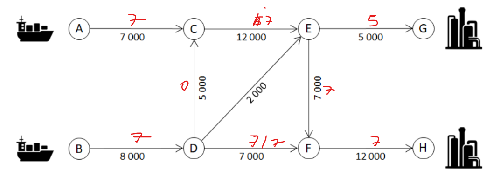
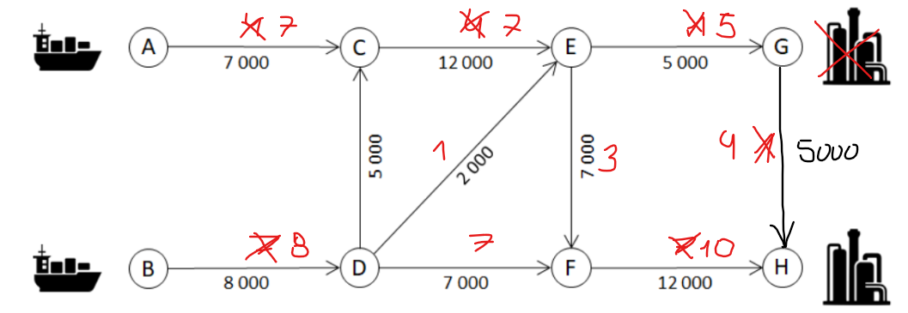

# Exame 2017/2018

## Teórica

1\. C  
2\. D  
3\. C  
4\. B  
5\. B  
6\. B  
7\. A  
8\. B  
9\. D  
10\. B  
11\. C  
12\. A  
13\. B  
15\. B  
16\. B  
17\. C  
18\. C  
19\. B  
20\. A  

## Prática

1\. a) 

2\.

3\. a) O fluxo máximo que é possível transportar na rede é de 28 (A -> C -> E -> F -> H).

&nbsp;&nbsp;&nbsp;&nbsp;b) O fluxo máximo que é possível transportar na rede é de 25 ().

4\.